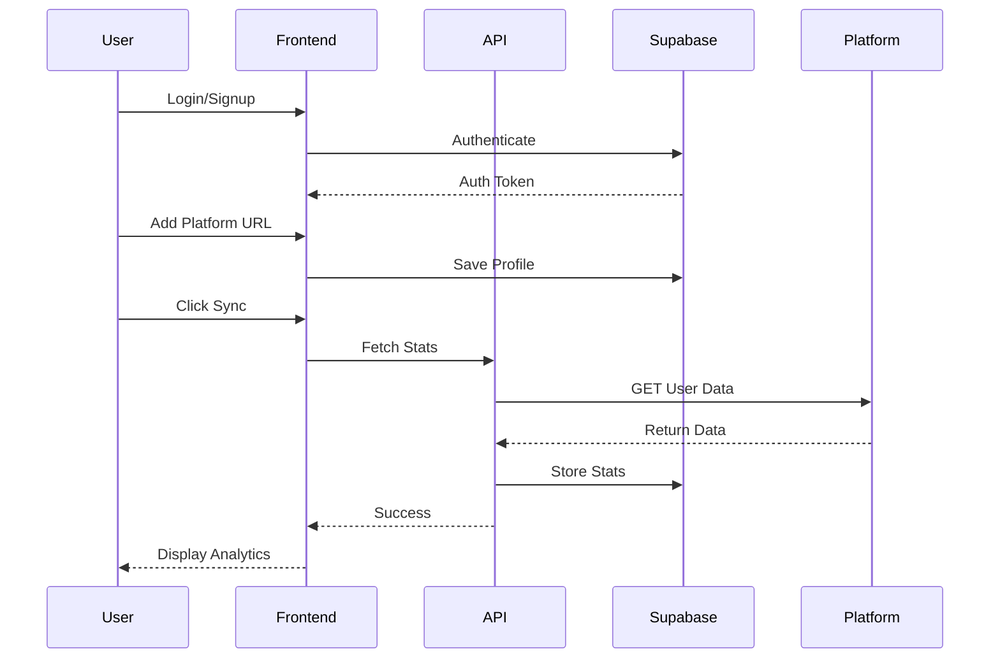
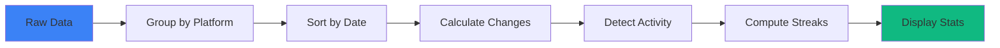

<div align="center">
  <h1>🚀 CodeOrbit</h1>
  <p><strong>Your Competitive Programming Analytics Hub</strong></p>
  
  [](https://code-orbit-n9aji9mxd-sameer-s-projects-06e61bca.vercel.app)
  [](LICENSE)
  [](https://react.dev/)
  [](https://vitejs.dev/)
  
  <p>Track your coding journey across multiple platforms with real-time analytics, streaks, and contest notifications</p>
</div>

---

## 📋 Table of Contents

- [✨ Features](#-features)
- [🎯 Demo](#-demo)
- [🏗️ Architecture](#️-architecture)
- [🛠️ Tech Stack](#️-tech-stack)
- [🚀 Getting Started](#-getting-started)
- [📊 How It Works](#-how-it-works)
- [🔧 Configuration](#-configuration)
- [📸 Screenshots](#-screenshots)
- [🤝 Contributing](#-contributing)
- [📄 License](#-license)

---

## ✨ Features

### 🎯 **Multi-Platform Support**
- **LeetCode** - Track total problems solved with automatic sync
- **CodeChef** - Monitor your rating and problem-solving progress
- **Codeforces** - Analyze unique problems across all contests

### 📊 **Advanced Analytics**
- **Real-Time Dashboard** - View your coding statistics at a glance
- **Platform Breakdown** - Individual stats for each coding platform
- **Activity Heatmap** - Visual representation of your coding patterns
- **Streak Tracking** - Current and longest streaks per platform
- **Daily Progress** - Charts showing your daily problem-solving trends

### 🏆 **Contest Tracking**
- **Upcoming Contests** - Never miss a contest across platforms
- **Multi-Platform Calendar** - Unified view of all coding competitions
- **Auto-Refresh** - Real-time updates of contest schedules

### 🎨 **Modern UI/UX**
- **Dark Mode** - Easy on the eyes with automatic theme switching
- **Responsive Design** - Seamless experience across all devices
- **Smooth Animations** - Framer Motion powered transitions
- **Interactive Charts** - Recharts for beautiful data visualization

---

## 🎯 Demo

🔗 **Live Application**: [https://code-orbit-n9aji9mxd-sameer-s-projects-06e61bca.vercel.app](https://code-orbit-n9aji9mxd-sameer-s-projects-06e61bca.vercel.app)

### Quick Start Guide:
1. **Sign Up** with your email
2. **Add Platform URLs** in Settings (e.g., `https://leetcode.com/username`)
3. **Sync Your Data** from the Dashboard
4. **View Analytics** and track your progress!

---

## 🏗️ Architecture



```mermaid
graph TB
    subgraph "Frontend Layer"
        A[React App] --> B[React Router]
        A --> C[Zustand State]
        A --> D[Framer Motion]
    end
    
    subgraph "API Layer"
        E[Vercel Serverless] --> F[LeetCode API]
        E --> G[CodeChef Scraper]
        E --> H[Codeforces API]
        E --> I[Clist API]
    end
    
    subgraph "Data Layer"
        J[Supabase Auth] --> K[PostgreSQL]
        K --> L[profiles table]
        K --> M[daily_stats table]
        K --> N[contests_cache table]
    end
    
    A --> E
    E --> K
    J --> A
    
    style A fill:#61dafb,stroke:#333,stroke-width:2px
    style E fill:#000,stroke:#333,stroke-width:2px
    style K fill:#3ecf8e,stroke:#333,stroke-width:2px
```

### Data Flow



---

## 🛠️ Tech Stack

### **Frontend**
| Technology | Version | Purpose |
|-----------|---------|---------|
|  | 19.2.0 | UI Library |
|  | 7.2.2 | Build Tool |
|  | 3.4.18 | Styling |
|  | 7.9.6 | Navigation |
|  | 5.0.8 | State Management |
|  | 12.23.24 | Animations |
|  | 3.4.1 | Data Visualization |

### **Backend**
| Technology | Purpose |
|-----------|---------|
|  | Serverless Functions |
|  | Database & Auth |
|  | HTTP Client |
|  | Web Scraping |

### **External APIs**
- **LeetCode GraphQL API** - Problem stats
- **Codeforces API** - Contest and problem data
- **CodeChef Web Scraping** - User profile stats
- **Clist API** - Unified contest calendar

---

## 🚀 Getting Started

### Prerequisites

- Node.js 18+ and npm
- Supabase account ([supabase.com](https://supabase.com))
- Vercel account for deployment ([vercel.com](https://vercel.com))

### Installation

1. **Clone the repository**
   ```bash
   git clone https://github.com/Sameer6305/CodeOrbit.git
   cd CodeOrbit
   ```

2. **Install dependencies**
   ```bash
   npm install
   ```

3. **Set up environment variables**
   
   Create a `.env` file in the root directory:
   ```env
   # Supabase Configuration
   VITE_SUPABASE_URL=your_supabase_url
   VITE_SUPABASE_ANON_KEY=your_supabase_anon_key
   SUPABASE_URL=your_supabase_url
   SUPABASE_SERVICE_KEY=your_supabase_service_role_key
   
   # Clist API (Optional - for contests)
   CLIST_API_TOKEN=your_clist_api_token
   ```

4. **Set up Supabase database**
   
   Run the SQL schema in your Supabase SQL Editor:
   ```bash
   # Copy contents from supabase/schema.sql
   # Paste and run in Supabase Dashboard → SQL Editor
   ```

5. **Run development server**
   ```bash
   npm run dev
   ```

6. **Open your browser**
   ```
   http://localhost:5173
   ```

### Deployment

#### Deploy to Vercel

1. **Install Vercel CLI**
   ```bash
   npm i -g vercel
   ```

2. **Deploy**
   ```bash
   vercel --prod
   ```

3. **Set environment variables** in Vercel Dashboard → Settings → Environment Variables

---

## 📊 How It Works

### 1. **User Authentication**
- Powered by Supabase Auth
- Email/password authentication
- Row Level Security (RLS) ensures data privacy

### 2. **Profile Management**
- Users add platform URLs (LeetCode, CodeChef, Codeforces)
- URLs are parsed to extract usernames
- Stored securely in `profiles` table

### 3. **Data Synchronization**

```javascript
// Sync Flow
User clicks "Sync" 
  → Frontend calls API routes
  → APIs fetch from platforms
  → Data stored as CUMULATIVE totals
  → Frontend calculates DAILY CHANGES
  → Display analytics with streaks
```

### 4. **Stats Calculation**

**Storage Strategy:**
- Store **cumulative totals** in database (e.g., 113 total LeetCode problems)
- Calculate **daily changes** on-the-fly (e.g., solved 5 today = 113 - 108)

**Streak Detection:**
- Activity detected when count increases
- Current streak: consecutive days with activity from today backwards
- Longest streak: maximum consecutive active days in history

### 5. **Contest Aggregation**
- Fetches from Clist API (unified source)
- Caches contests in `contests_cache` table
- Auto-refresh every 6 hours
- Displays upcoming contests across all platforms

---

## 🔧 Configuration

### Database Schema

```sql
-- profiles: User platform handles
CREATE TABLE profiles (
  id UUID PRIMARY KEY,
  email TEXT,
  leetcode_username TEXT,
  codechef_handle TEXT,
  codeforces_handle TEXT
);

-- daily_stats: Cumulative problem counts
CREATE TABLE daily_stats (
  id UUID PRIMARY KEY,
  user_id UUID REFERENCES profiles(id),
  platform TEXT,
  solved_count INTEGER,
  date DATE,
  UNIQUE(user_id, date, platform)
);

-- contests_cache: Upcoming contests
CREATE TABLE contests_cache (
  id UUID PRIMARY KEY,
  title TEXT,
  platform TEXT,
  start_time TIMESTAMPTZ,
  duration INTEGER,
  url TEXT
);
```

### API Routes

| Route | Method | Purpose |
|-------|--------|---------|
| `/api/leetcode` | POST | Fetch LeetCode stats |
| `/api/codechef` | POST | Scrape CodeChef profile |
| `/api/codeforces` | POST | Get Codeforces problems |
| `/api/contests` | GET | List upcoming contests |

---

## 📸 Screenshots

### Dashboard

*Real-time overview of coding statistics with platform breakdown*

### Analytics

*Detailed charts and heatmaps showing coding patterns*

### Contests

*Upcoming contests across all platforms*

### Settings

*Platform configuration and profile management*

---

## 🎨 Key Features Breakdown

### 📈 Analytics Engine



### 🔄 Sync Process

1. **User Initiates Sync** → Click "Sync All Platforms"
2. **API Calls** → Parallel requests to platform APIs
3. **Data Processing** → Extract relevant statistics
4. **Database Update** → Upsert with conflict resolution
5. **Frontend Update** → Fetch latest stats and recalculate
6. **UI Refresh** → Display updated analytics with animations

---

## 🤝 Contributing

Contributions are welcome! Here's how you can help:

1. **Fork the repository**
2. **Create a feature branch**
   ```bash
   git checkout -b feature/amazing-feature
   ```
3. **Commit your changes**
   ```bash
   git commit -m 'Add amazing feature'
   ```
4. **Push to the branch**
   ```bash
   git push origin feature/amazing-feature
   ```
5. **Open a Pull Request**

### Development Guidelines

- Follow existing code style
- Add comments for complex logic
- Update README for new features
- Test thoroughly before submitting

---

## 🐛 Known Issues & Roadmap

### Current Limitations
- CodeChef scraping may fail if profile is private
- Contest sync limited to Clist API availability
- Historical data requires manual backfilling

### Future Enhancements
- [ ] Add HackerRank support
- [ ] Export analytics as PDF
- [ ] Email notifications for contests
- [ ] Friend comparison feature
- [ ] Mobile app (React Native)
- [ ] AI-powered insights
- [ ] Custom goal setting

---

## 📄 License

This project is licensed under the MIT License - see the [LICENSE](LICENSE) file for details.

---

## 🙏 Acknowledgments

- [LeetCode](https://leetcode.com) for the problem-solving platform
- [CodeChef](https://codechef.com) for competitive programming contests
- [Codeforces](https://codeforces.com) for the API and community
- [Clist](https://clist.by) for unified contest calendar
- [Supabase](https://supabase.com) for backend infrastructure
- [Vercel](https://vercel.com) for seamless deployment

---

## 💬 Support

If you have any questions or run into issues:

- 📧 Email: support@codeorbit.dev
- 🐛 Issues: [GitHub Issues](https://github.com/Sameer6305/CodeOrbit/issues)
- 💬 Discussions: [GitHub Discussions](https://github.com/Sameer6305/CodeOrbit/discussions)

---

## ⭐ Show Your Support

If you find CodeOrbit helpful, please consider:
- ⭐ Starring the repository
- 🐛 Reporting bugs
- 💡 Suggesting new features
- 🤝 Contributing to the code

---

<div align="center">
  <p>Made with ❤️ by developers, for developers</p>
  <p>© 2025 CodeOrbit. All rights reserved.</p>
  
  [](https://github.com/Sameer6305/CodeOrbit)
  [](https://github.com/Sameer6305/CodeOrbit/fork)
</div>
