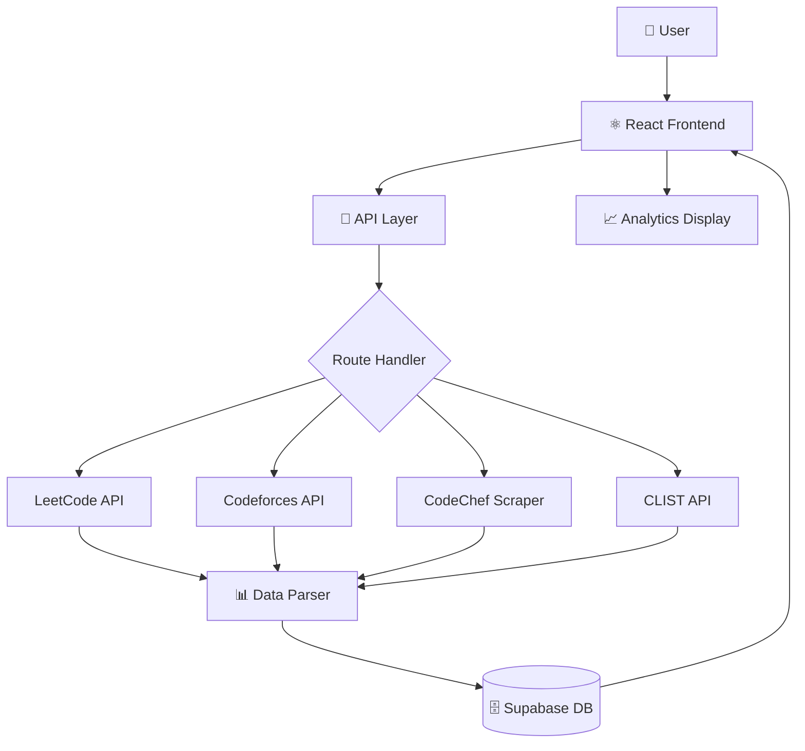
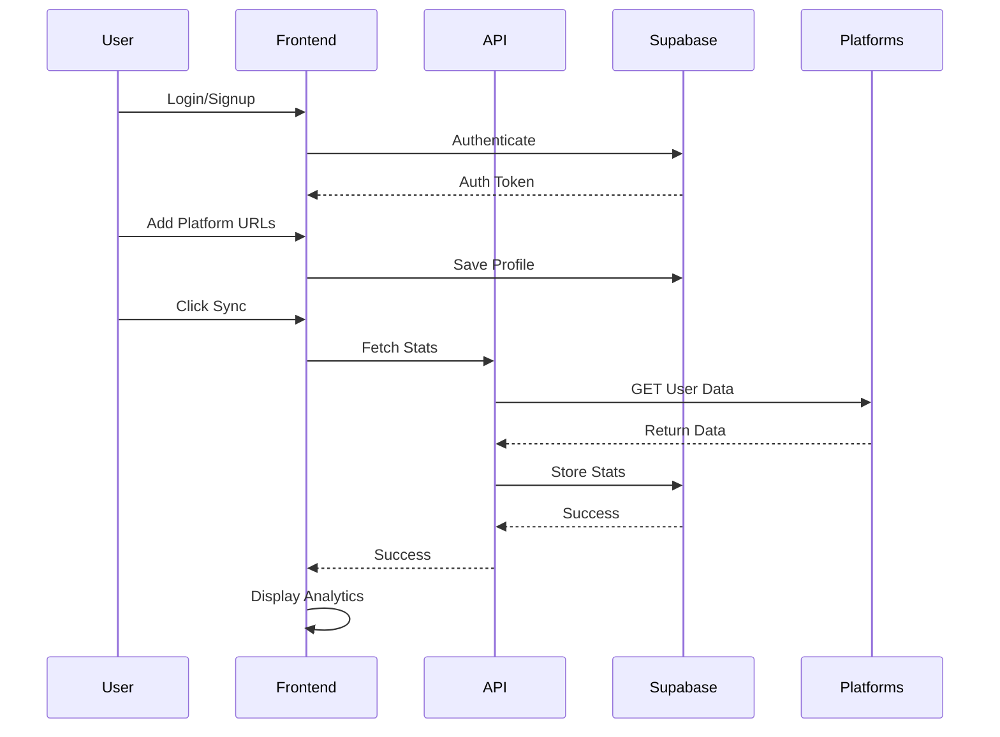
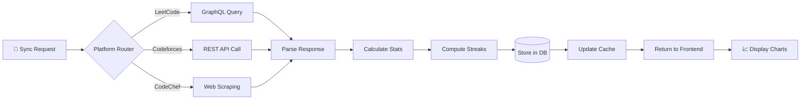
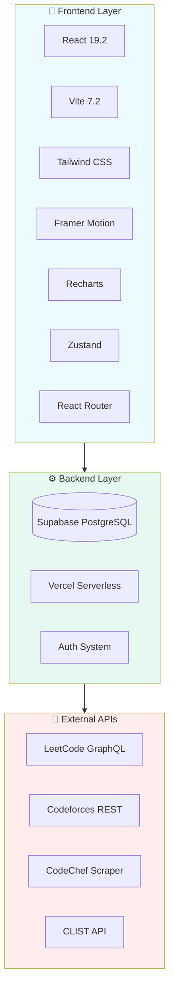
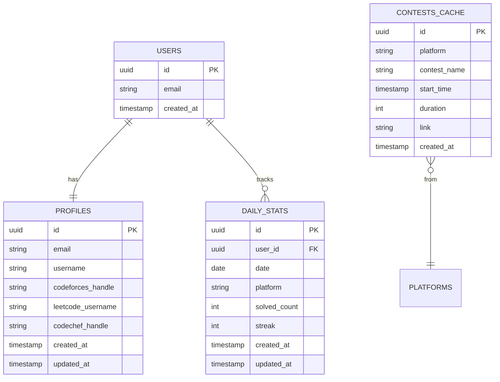

<div align="center">

# 🚀 CodeOrbit

### *Your Ultimate Competitive Programming Analytics Hub*

[](https://code-orbit-3ufbw176d-sameer-s-projects-06e61bca.vercel.app)
[](LICENSE)
[](https://react.dev/)
[](https://supabase.com/)

*Track, analyze, and optimize your coding journey across LeetCode, Codeforces, and CodeChef*

[Features](#-features) • [Demo](#-demo) • [Installation](#-installation) • [Tech Stack](#-tech-stack) • [Contributing](#-contributing)

</div>

---

## 📖 About

**CodeOrbit** is a comprehensive analytics dashboard for competitive programmers that consolidates your coding statistics from multiple platforms into a single, beautiful interface. Monitor your progress, track streaks, analyze activity patterns, and never miss a contest!

### 🏗️ System Architecture


```mermaid
graph TB
    User[👤 User] --> Frontend[⚛️ React Frontend]
    Frontend --> API[🔌 API Layer]
    
    API --> Router{Route Handler}
    
    Router --> LeetCode[LeetCode API]
    Router --> Codeforces[Codeforces API]
    Router --> CodeChef[CodeChef Scraper]
    Router --> CLIST[CLIST API]
    
    LeetCode --> Parser[📊 Data Parser]
    Codeforces --> Parser
    CodeChef --> Parser
    CLIST --> Parser
    
    Parser --> Supabase[(🗄️ Supabase DB)]
    Supabase --> Frontend
    
    Frontend --> Charts[📈 Analytics Display]
```

### 🔄 Data Flow Sequence


```mermaid
sequenceDiagram
    participant User
    participant Frontend
    participant API
    participant Supabase
    participant Platforms
    
    User->>Frontend: Login/Signup
    Frontend->>Supabase: Authenticate
    Supabase-->>Frontend: Auth Token
    
    User->>Frontend: Add Platform URLs
    Frontend->>Supabase: Save Profile
    
    User->>Frontend: Click Sync
    Frontend->>API: Fetch Stats
    API->>Platforms: GET User Data
    Platforms-->>API: Return Data
    API->>Supabase: Store Stats
    Supabase-->>API: Success
    API-->>Frontend: Success
    Frontend->>Frontend: Display Analytics
```

### Why CodeOrbit?

- 📊 **Unified Analytics** - All your coding stats in one place
- 🔄 **Real-Time Sync** - Automatic data synchronization across platforms
- 📈 **Visual Insights** - Interactive charts, heatmaps, and trend analysis
- 🏆 **Contest Tracking** - Never miss an upcoming coding competition
- 🎯 **Goal Tracking** - Monitor streaks and set personal milestones
- 🌙 **Modern UI** - Beautiful dark mode with smooth animations

---

## ✨ Features

### 🎯 Multi-Platform Integration
<table>
  <tr>
    <td width="33%" align="center">
      <h4>🟡 LeetCode</h4>
      <p>Track solved problems, submission calendar, and activity patterns</p>
    </td>
    <td width="33%" align="center">
      <h4>🔵 Codeforces</h4>
      <p>Monitor unique problems solved across contests and practice</p>
    </td>
    <td width="33%" align="center">
      <h4>🟤 CodeChef</h4>
      <p>Analyze rating progress and problem-solving consistency</p>
    </td>
  </tr>
</table>

### 📊 Powerful Analytics

- **📈 Activity Heatmap** - GitHub-style contribution graph showing your coding consistency
- **📉 Monthly Trends** - Visualize problem-solving patterns over time
- **🎨 Platform Radar Chart** - Compare your performance across different platforms
- **🔥 Streak Tracking** - Current and longest streaks for each platform
- **📊 Problem Type Analysis** - Breakdown of problems by difficulty and category

### 🏆 Contest Management

- **Upcoming Contests** - Real-time updates from CLIST API
- **Multi-Platform Calendar** - See all contests in one unified view
- **Smart Notifications** - Time-until-start countdown for each contest
- **Quick Links** - Direct access to contest registration pages

### 🎨 User Experience

- **Dark/Light Mode** - Automatic theme switching with smooth transitions
- **Responsive Design** - Optimized for desktop, tablet, and mobile
- **Smooth Animations** - Framer Motion powered UI transitions
- **Interactive Charts** - Recharts visualizations with tooltips and legends

---

## 🎥 Demo

### Dashboard Overview
The main dashboard provides a comprehensive view of your coding statistics across all platforms.

**Key Metrics:**
- Total problems solved
- Active coding days
- Current streaks per platform
- Platform-wise breakdown
- Recent activity trends

### Activity Heatmap
Visual representation of your daily coding activity, similar to GitHub contributions graph.

### Contest Widget
Stay updated with upcoming contests from LeetCode, Codeforces, and CodeChef.

### 📊 Data Processing Pipeline


```mermaid
graph LR
    A[🔄 Sync Request] --> B{Platform Router}
    
    B -->|LeetCode| C[GraphQL Query]
    B -->|Codeforces| D[REST API Call]
    B -->|CodeChef| E[Web Scraping]
    
    C --> F[Parse Response]
    D --> F
    E --> F
    
    F --> G[Calculate Stats]
    G --> H[Compute Streaks]
    H --> I[(Store in DB)]
    
    I --> J[Update Cache]
    J --> K[Return to Frontend]
    K --> L[📈 Display Charts]
```

---

## 🛠️ Tech Stack


```mermaid
graph TB
    subgraph Frontend["🎨 Frontend Layer"]
        React[React 19.2]
        Vite[Vite 7.2]
        Tailwind[Tailwind CSS]
        Framer[Framer Motion]
        Recharts[Recharts]
        Zustand[Zustand]
        Router[React Router]
    end
    
    subgraph Backend["⚙️ Backend Layer"]
        Supabase[(Supabase PostgreSQL)]
        Vercel[Vercel Serverless]
        Auth[Auth System]
    end
    
    subgraph APIs["🔌 External APIs"]
        LC[LeetCode GraphQL]
        CF[Codeforces REST]
        CC[CodeChef Scraper]
        CLIST[CLIST API]
    end
    
    Frontend --> Backend
    Backend --> APIs
    
    style Frontend fill:#61dafb20
    style Backend fill:#3ecf8e20
    style APIs fill:#ff6b6b20
```

### Frontend
- **React 19.2** - UI framework with latest features
- **Vite 7.2** - Lightning-fast build tool
- **Tailwind CSS** - Utility-first styling
- **Framer Motion** - Smooth animations
- **Recharts** - Interactive data visualizations
- **Zustand** - Lightweight state management
- **React Router** - Client-side routing

### Backend & APIs
- **Supabase** - PostgreSQL database & authentication
- **Vercel Serverless Functions** - API routes
- **Axios** - HTTP client for API requests
- **Cheerio** - Web scraping for CodeChef data

### External APIs
- **LeetCode GraphQL API** - User statistics and submission calendar
- **Codeforces API** - Submission history and contest data
- **CLIST API** - Contest schedules across platforms
- **CodeChef Scraping** - User profile data

---

## 🚀 Installation

### Prerequisites
- Node.js 18+ and npm
- Supabase account
- CLIST API token (optional, for contest data)

### 1. Clone the Repository
```bash
git clone https://github.com/Sameer6305/CodeOrbit.git
cd CodeOrbit
```

### 2. Install Dependencies
```bash
npm install
```

### 3. Set Up Supabase

#### Create a Supabase Project
1. Go to [supabase.com](https://supabase.com)
2. Create a new project
3. Copy your project URL and anon key

#### Run Database Schema
1. Open Supabase SQL Editor
2. Copy and paste the contents of `supabase/schema.sql`
3. Click "RUN" to create tables and policies

### 4. Configure Environment Variables
Create a `.env` file in the root directory:

```env
# Supabase Configuration
VITE_SUPABASE_URL=your_supabase_project_url
VITE_SUPABASE_ANON_KEY=your_supabase_anon_key

# Server-side keys (for API routes)
SUPABASE_URL=your_supabase_project_url
SUPABASE_SERVICE_KEY=your_supabase_service_role_key

# CLIST API (optional - for contest data)
CLIST_API_TOKEN=your_clist_api_token
```

**Get CLIST API Token:**
1. Register at [clist.by](https://clist.by/)
2. Go to Settings → API
3. Generate an API key

### 5. Run Development Server
```bash
npm run dev
```

Visit `http://localhost:5173` to see your app!

### 6. Deploy to Vercel

#### Install Vercel CLI
```bash
npm install -g vercel
```

#### Deploy
```bash
vercel --prod
```

Add environment variables in Vercel dashboard under Settings → Environment Variables.

---

## 📖 Usage Guide

### 1. Create an Account
- Sign up using email and password
- Or use the demo account (if available)

### 2. Add Platform Handles
Go to **Settings** and add your usernames:
- **LeetCode Username** (e.g., `yourname`)
- **Codeforces Handle** (e.g., `yourhandle`)
- **CodeChef Handle** (e.g., `yourhandle`)

### 3. Sync Your Data
- Navigate to the **Dashboard**
- Click "Sync All Platforms" button
- Wait for data to be fetched (3-5 seconds)
- Refresh the page to see your statistics

### 4. Explore Analytics
- **Dashboard** - Overview of all statistics
- **Analytics** - Detailed charts and trends
- **Contests** - Upcoming competitions
- **Benchmark** - Compare with other users (coming soon)

---

## 📁 Project Structure

```
codeorbit/
├── api/                      # Vercel serverless functions
│   ├── badges.js            # Badge counting API
│   ├── codechef.js          # CodeChef data sync
│   ├── codeforces.js        # Codeforces data sync
│   ├── contests.js          # Contest fetching
│   ├── leetcode.js          # LeetCode data sync
│   ├── problem-types.js     # Problem categorization
│   ├── submission-calendar.js # Activity calendar
│   └── utils/
│       └── streakCalculator.js # Streak computation
├── src/
│   ├── components/          # React components
│   │   ├── ActivityChart.jsx
│   │   ├── ContestWidget.jsx
│   │   ├── HeatmapChart.jsx
│   │   ├── Layout.jsx
│   │   ├── Navbar.jsx
│   │   ├── PlatformRadarChart.jsx
│   │   └── StatCard.jsx
│   ├── pages/               # Route pages
│   │   ├── Analytics.jsx
│   │   ├── Contests.jsx
│   │   ├── Dashboard.jsx
│   │   ├── Login.jsx
│   │   ├── Settings.jsx
│   │   └── Signup.jsx
│   ├── store/               # Zustand state management
│   │   ├── auth.js
│   │   ├── profile.js
│   │   ├── stats.js
│   │   └── theme.js
│   ├── utils/               # Helper functions
│   │   ├── platformHelpers.js
│   │   ├── platformParser.js
│   │   └── streakCalculator.js
│   ├── lib/
│   │   └── supabase.js      # Supabase client
│   ├── App.jsx              # Main app component
│   └── main.jsx             # Entry point
├── supabase/
│   └── schema.sql           # Database schema
├── public/                  # Static assets
├── .env                     # Environment variables
├── package.json             # Dependencies
├── vite.config.js           # Vite configuration
└── vercel.json              # Vercel deployment config
```

---

## 🔧 Configuration

### Database Schema


```mermaid
erDiagram
    USERS ||--|| PROFILES : has
    USERS ||--o{ DAILY_STATS : tracks
    CONTESTS_CACHE }o--|| PLATFORMS : from
    
    USERS {
        uuid id PK
        string email
        timestamp created_at
    }
    
    PROFILES {
        uuid id PK
        string email
        string username
        string codeforces_handle
        string leetcode_username
        string codechef_handle
        timestamp created_at
        timestamp updated_at
    }
    
    DAILY_STATS {
        uuid id PK
        uuid user_id FK
        date date
        string platform
        int solved_count
        int streak
        timestamp created_at
        timestamp updated_at
    }
    
    CONTESTS_CACHE {
        uuid id PK
        string platform
        string contest_name
        timestamp start_time
        int duration
        string link
        timestamp created_at
    }
```

The app uses PostgreSQL with the following tables:

- **profiles** - User profile information and platform handles
- **daily_stats** - Daily problem-solving statistics per platform
- **contests_cache** - Cached contest information

See `supabase/schema.sql` for complete schema definition.

### API Rate Limits
- **LeetCode API**: No official limit, use responsibly
- **Codeforces API**: 5 requests per 2 seconds
- **CLIST API**: 10,000 requests per day (free tier)
- **CodeChef**: Web scraping, use with delays

---

## 🤝 Contributing

Contributions are welcome! Here's how you can help:

### Reporting Bugs
Open an issue with:
- Bug description
- Steps to reproduce
- Expected vs actual behavior
- Screenshots (if applicable)

### Suggesting Features
Open an issue with:
- Feature description
- Use case
- Mockups (if applicable)

### Pull Requests
1. Fork the repository
2. Create a feature branch: `git checkout -b feature-name`
3. Commit changes: `git commit -m 'Add feature'`
4. Push to branch: `git push origin feature-name`
5. Open a pull request

### Development Guidelines
- Follow existing code style
- Write meaningful commit messages
- Test thoroughly before submitting
- Update documentation as needed

---

## 🐛 Known Issues

- CodeChef activity shows distributed data for single-record users
- Contest API may occasionally timeout
- Real-time sync can take 3-5 seconds per platform

See [Issues](https://github.com/Sameer6305/CodeOrbit/issues) for full list.

---

## 📝 License

This project is licensed under the MIT License - see the [LICENSE](LICENSE) file for details.

---

## 🙏 Acknowledgments

- **LeetCode** for their GraphQL API
- **Codeforces** for their public API
- **CodeChef** for maintaining public profiles
- **CLIST** for contest aggregation API
- **Supabase** for backend infrastructure
- **Vercel** for hosting and serverless functions

---

## 📧 Contact

**Sameer Kadam**
- GitHub: [@Sameer6305](https://github.com/Sameer6305)
- Project Link: [https://github.com/Sameer6305/CodeOrbit](https://github.com/Sameer6305/CodeOrbit)

---

<div align="center">

### ⭐ Star this repo if you find it helpful!

Made with ❤️ by [Sameer Kadam](https://github.com/Sameer6305)

</div>
